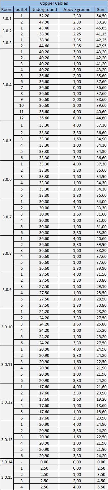
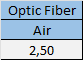

# Building 3 #
## 1. Introduction
    This file documents the planning of the Building 3.

### 1.2. TODO: Subtitles Image

## 2. Building Structure
### 2.1. Building Dimensions ### 
    Number of floors: 2
    Area: 30x30 (900 m^2)

### 2.2. Ground Floor ###

### 2.2.1. Floor Layout ###

### 2.2.2. Rooms ###

| Rooms  |    Size    | Area | Outlets |
|:------:|:----------:|:----:|:-------:|
| 3.0.1  | 8,6 x 7,5  | 64,5 |    2    |
| 3.0.2  | 9,0 x 7,5  | 67,5 |    2    |
| 3.0.3  | 11,4 x 7,5 | 85,5 |    2    |
| 3.0.4  | 8,1 x 7,2  | 58,3 |   12    |
| 3.0.5  | 6,6 x 3,3  | 21,8 |    6    |
| 3.0.6  | 6,6 x 3,3  | 21,8 |    6    |
| 3.0.7  | 6,6 x 3,3  | 21,8 |    6    |
| 3.0.8  | 6,6 x 3,3  | 21,8 |    6    |
| 3.0.9  | 6,6 x 3,3  | 21,8 |    6    |
| 3.0.10 | 6,6 x 3,3  | 21,8 |    6    |
| 3.0.11 | 6,6 x 3,3  | 21,8 |    6    |
| 3.0.12 | 6,6 x 3,3  | 21,8 |    6    |
| 3.0.13 | 6,6 x 3,3  | 21,8 |    6    |
| 3.0.14 | 3,3 x 2,5  | 8,3  |    0    |
| 3.0.15 | 3,3 x 4,2  | 13,9 |    4    |

### 2.3. First Floor ###
### 2.3.1. Floor Layout ###

### 2.3.2. Rooms ###

| Rooms  |   Size    | Area | Outlets |
|:------:|:---------:|:----:|:-------:|
| 3.1.1  | 5,3 x 7,8 | 31,3 |   10    |
| 3.1.2  | 5,3 x 3,3 | 17,5 |    4    |
| 3.1.3  | 5,3 x 3,3 | 17,5 |    4    |
| 3.1.4  | 5,3 x 3,3 | 17,5 |    4    |
| 3.1.5  | 5,3 x 3,3 | 17,5 |    4    |
| 3.1.6  | 8,6 x 3,3 | 17,5 |    4    |
| 3.1.7  | 8,6 x 3,3 | 17,5 |    4    |
| 3.1.8  |  2 x 6,9  | 13,8 |    4    |
| 3.1.9  | 5,3 x 3,3 | 17,5 |    4    |
| 3.1.10 | 5,3 x 3,3 | 17,5 |    4    |
| 3.1.11 | 5,3 x 3,3 | 17,5 |    4    |
| 3.1.12 | 5,3 x 3,3 | 17,5 |    4    |
| 3.1.13 | 5,3 x 3,3 | 17,5 |    4    |
| 3.1.14 | 5,3 x 3,3 | 17,5 |    4    |
| 3.1.15 | 5,3 x 3,3 | 17,5 |    4    |
| 3.1.16 | 5,3 x 3,3 | 17,5 |    4    |
| 3.1.17 | 5,3 x 3,3 | 17,5 |    4    |
| 3.1.18 | 5,3 x 3,3 | 17,5 |    4    |
| 3.1.19 | 5,3 x 3,3 | 17,5 |    4    |
| 3.1.20 | 5,3 x 3,3 | 17,5 |    4    |

## 3. Outlets and  Acess Points ###
    We assumed that this building will be used by a large number of people, so we designed the network to support a large an equaly large number of devices simultaneously.
    The number of devices that the network support simultaneously can be increased by upgrading the model of the acess points or adding more acess points.
    In this project, we chose a model that supports up to 30 devices.
    Please note that adding more access points may change the layout and configuration of the rest.
### 3.1. Outlets ###
#### 3.1.1. Overview ####
| Floor  | Outlets |
|:------:|:-------:|
| Ground |   76    | 
| First  |   86    |
   
### 3.2. Acess Points ###
#### 3.2.1. Overview ####

| Floor  | Access Points | Max Devices (people) |
|:------:|:-------------:|:--------------------:|
| Ground |       9       |      270 (135)       |
| First  |       4       |       120 (60)       |

#### 3.2.2. Configuration ####
    All the acess points are placed in the cealing.
    The power and range of the signal is configured individually for each access point to garantee that the signals of every access point don't overlap more than 15% with each other and also to not waste signal to the outside of the building.
    The radius of every access point is configured to be around 2-3 meters to 6-7 meters.
#### 3.2.3 Location ####
##### 3.2.1. Ground Floor #####

##### 3.2.2. First Floor #####

## 4. Cross-Connections ##

### 4.1. Location ###

#### 4.1.1. Intermediate Cross-Connect (ICC) #### 
    Only one ICC is needed for this building.
    The intermidiate cross-connect for this building is located in the room 3.0.14 (storage room in the ground floor).
    For this to be possible, the optical fiber comming from the outside the building is beeing conducted to this room via underground cable passageways.

#### 4.1.2. Horizontal Cross-Connects (HCCs) ####
    Only 2 HCCs are needed in this building, 1 per floor.
    In the ground floor it is located in the room 3.0.14 and in the first floor, it is right above in room 3.1.18.
## 5. Cables ##
### 5.1. Layout ###
    Each connection to a outlet ou a acess point is a distinct cable. 
    Each one of these cables come directly from the floor's respective HCC.
#### 5.1.1. Ground Floor ####

#### 5.1.2. First Floor ####

### 5.2. Types ###
    Optical fiber is only used to conduct the signal from outside to the ICC.
    The rest of the cables are used to make the connection from the HCC to the outlets and the access points.
    The type of the cables was determined to be Monomode Optical Fiber and Cat7 Coper Cables.

### 5.3. Length ###
#### 5.3.1. Ground Floor ####

#### 5.3.2. First Floor ####

