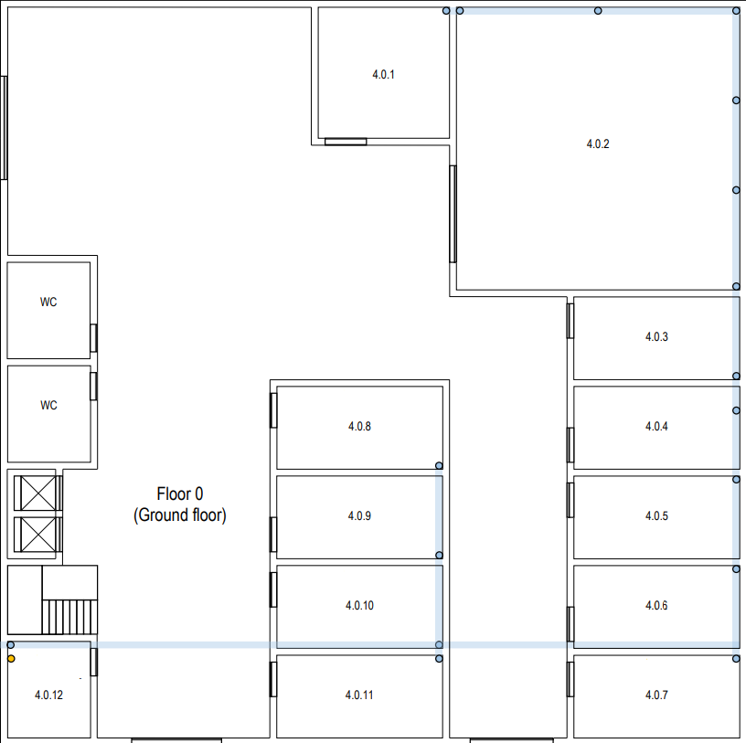
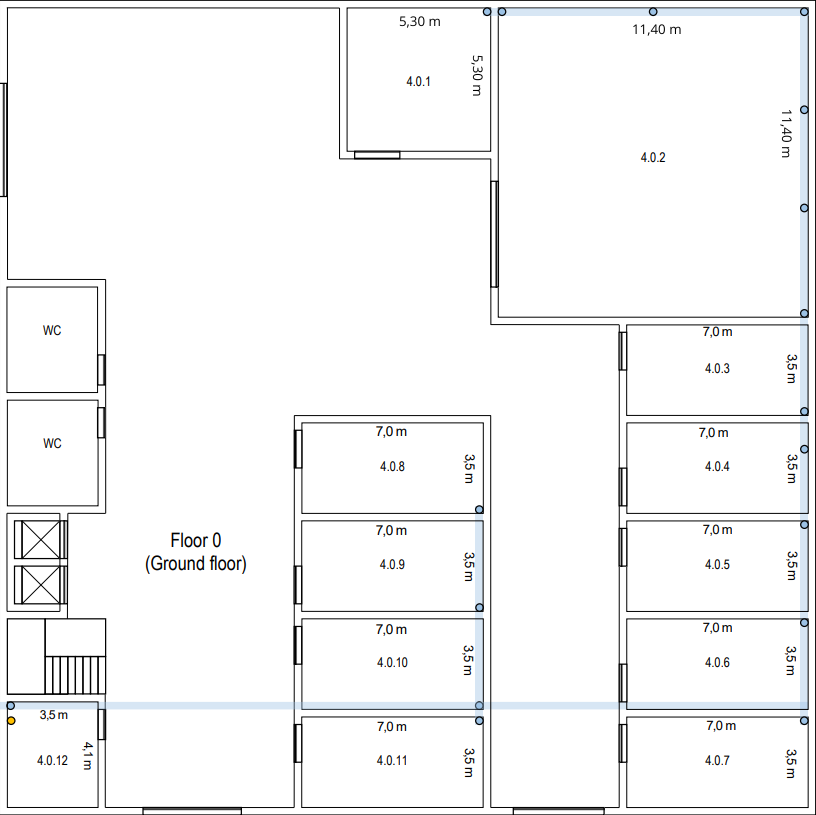
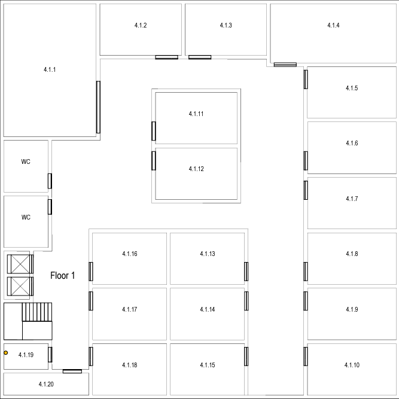
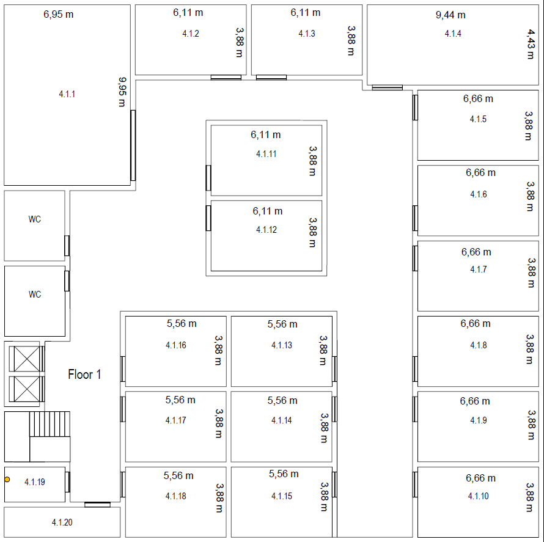

# Building 4 #

## 1. Introduction ##
    This file documents the planning of the Building 4.

## Building Structure ##
### 1.1. Building Dimensions ### 
    Number of floors: 2
    Area: 30m x 30m = 900 m^2
    Height on floor 0: 4 meters
    Height on floor 1: 3 meters with a removable ceiling placed 2.5 meters above the floor.

### 1.2. Floor 0 ###
#### 1.2.1. Floor Layout ####

#### 1.2.2. Rooms ####

| Rooms  |           Size           |  Area  | Outlets |
|:------:|:------------------------:|:------:|:-------:|
| 4.0.1  |       5,30 x 5,30        | 28,09  |    6    |
| 4.0.2  |      11,40 x 11,40       | 129,96 |   12    |
| 4.0.3  |       7,00 x 3,50        | 24,50  |    6    |
| 4.0.4  |       7,00 x 3,50        | 24,50  |    6    |
| 4.0.5  |       7,00 x 3,50        | 24,50  |    6    |
| 4.0.6  |       7,00 x 3,50        | 24,50  |    6    |
| 4.0.7  |       7,00 x 3,50        | 24,50  |    6    |
| 4.0.8  |       7,00 x 3,50        | 24,50  |    6    |
| 4.0.9  |       7,00 x 3,50        | 24,50  |    6    |
| 4.0.10 |       7,00 x 3,50        | 24,50  |    6    |
| 4.0.11 |       7,00 x 3,50        | 24,50  |    6    |

### Measurements ###

### 1.3. Floor 1 ###
#### 1.3.1. Floor Layout ####

#### 1.3.2. Rooms ####

| Rooms  |     Size     |  Area  | Outlets |
|:------:|:------------:|:------:|:-------:|
| 4.1.1  | 6,95 x 6,95  | 69,15  |   14    |
| 4.1.2  | 6,11 x 3,88  | 23,71  |    6    |
| 4.1.3  | 6,11 x 3,88  | 23,71  |    6    |
| 4.1.4  | 9,44 x 4,43  | 41,82  |   10    |
| 4.1.5  | 6,66 x 3,88  | 25,84  |    6    |
| 4.1.6  | 6,66 x 3,88  | 25,84  |    6    |
| 4.1.7  | 6,66 x 3,88  | 25,84  |    6    |
| 4.1.8  | 6,66 x 3,88  | 25,84  |    6    |
| 4.1.9  | 6,66 x 3,88  | 25,84  |    6    |
| 4.1.10 | 6,66 x 3,88  | 25,84  |    6    |
| 4.1.11 | 6,11 x 3,88  | 23,71  |    6    | 
| 4.1.12 | 6,11 x 3,88  | 23,71  |    6    |
| 4.1.13 | 5,56 x 3,88  | 21,57  |    6    |
| 4.1.14 | 5,56 x 3,88  | 21,57  |    6    |
| 4.1.15 | 5,56 x 3,88  | 21,57  |    6    |
| 4.1.16 | 5,56 x 3,88  | 21,57  |    6    |
| 4.1.17 | 5,56 x 3,88  | 21,57  |    6    |
| 4.1.18 | 5,56 x 3,88  | 21,57  |    6    |

### Measurements ###

## 3. Outlets and  Acess Points ###
### 3.1. Outlets ###
#### 3.1.1. Overview ####
| Floor  | Outlets |
|:------:|:-------:|
| Ground |   72    |             
| First  |   120   |   

### 3.2. Acess Points ###
#### 3.2.1. Overview ####

| Floor  | Access Points | Max Devices (people) |
|:------:|:-------------:|:--------------------:|
| Ground |       4       |                      |
| First  |       -       |          -           |

## 4. Cross-Connections ##

### 4.1. Location ###

#### 4.1.1. Intermediate Cross-Connect (ICC) #### 
    Only one ICC is needed for this building.
    The intermidiate cross-connect for this building is located in the room 4.0.12 (storage area in the ground floor).
    For this to be possible, the optical fiber comming from the outside the building is beeing conducted to this room via underground cable passageways.

#### 4.1.2. Horizontal Cross-Connects (HCCs) ####
    Only 2 HCCs are needed in this building, 1 per floor.
    In the ground floor it is located in the room 4.0.12 and in the first floor, it is right above in room 4.1.19.
