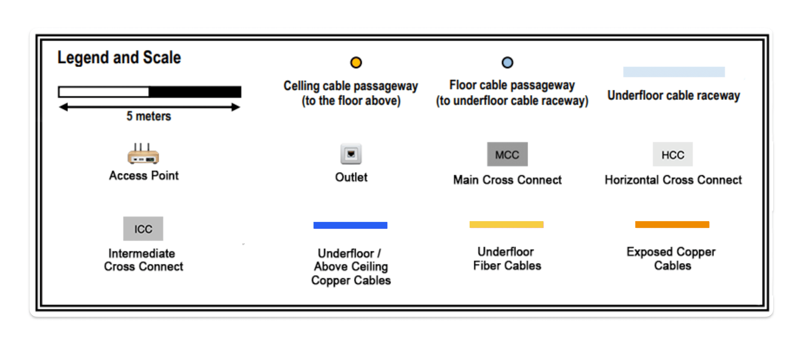
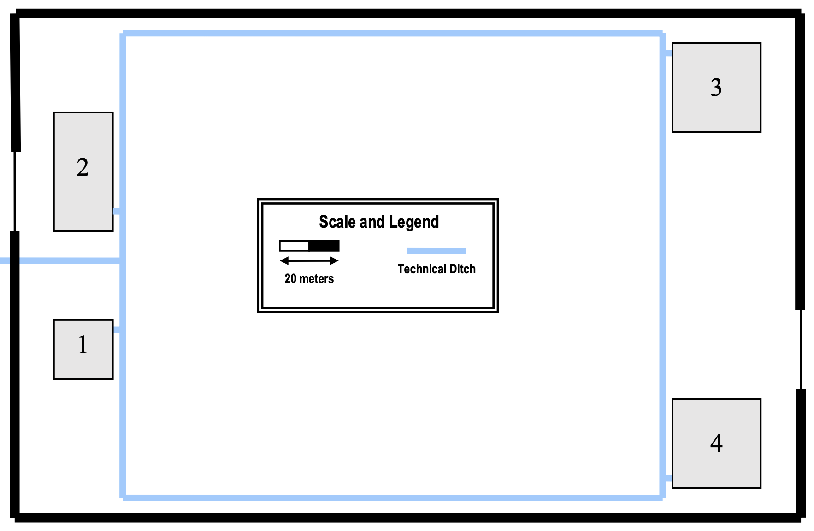
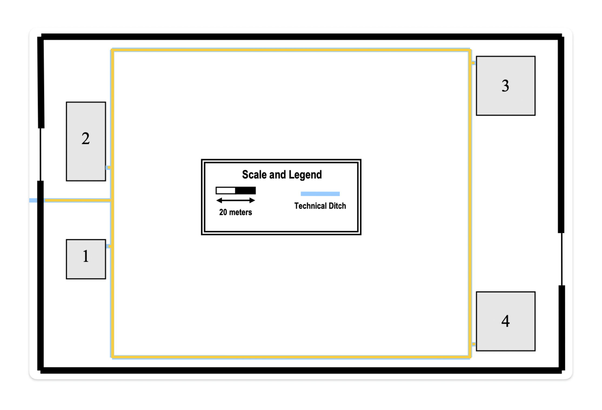
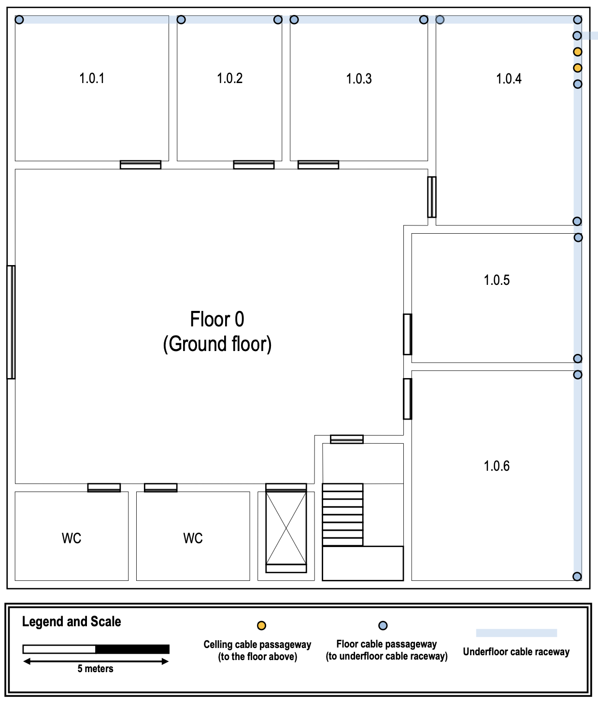
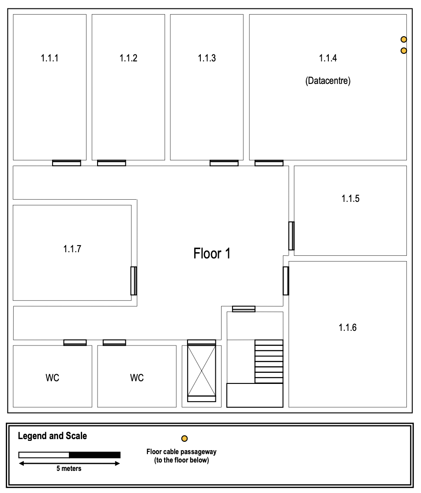
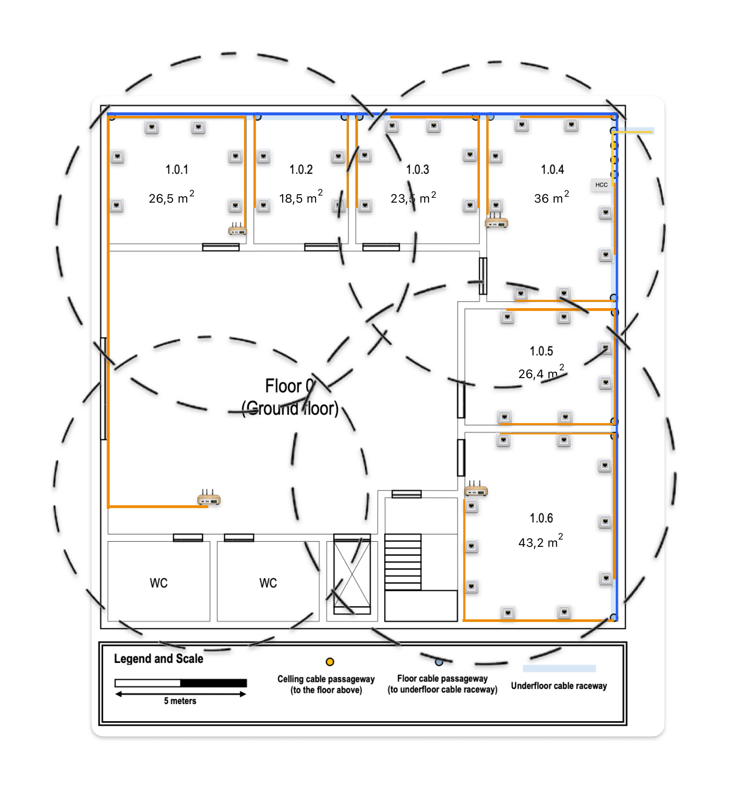
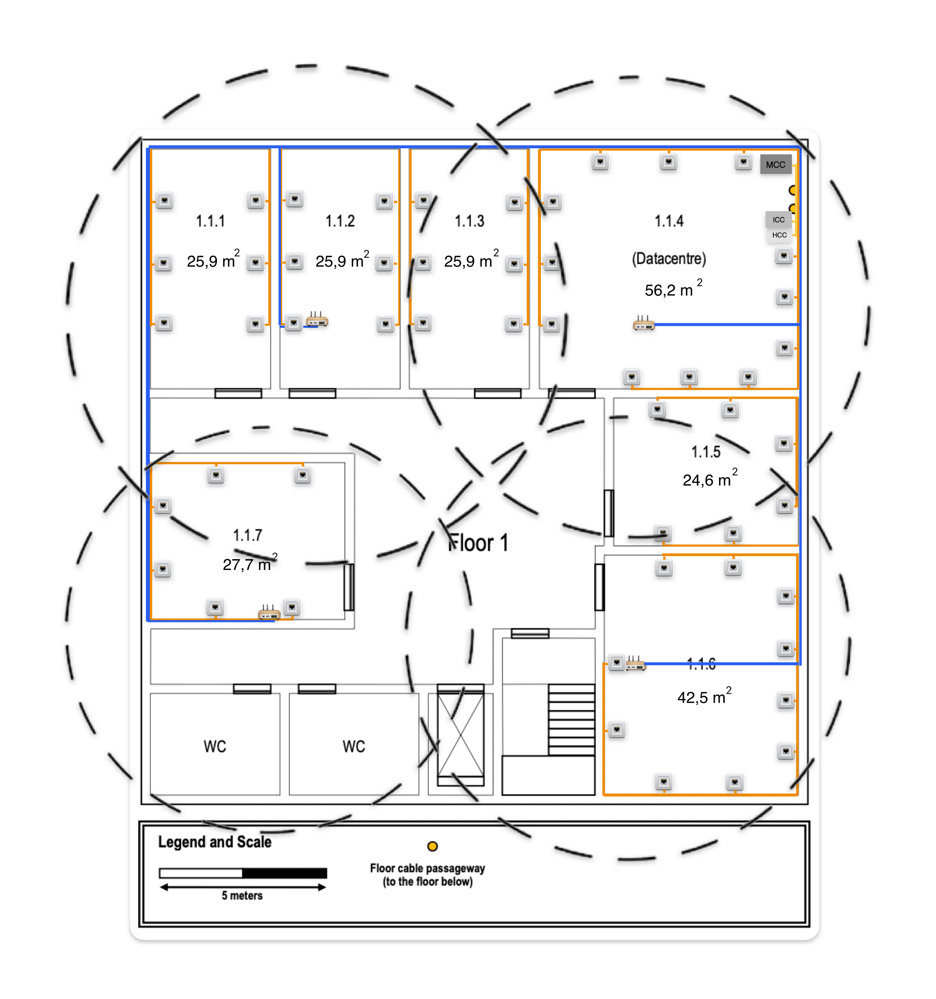
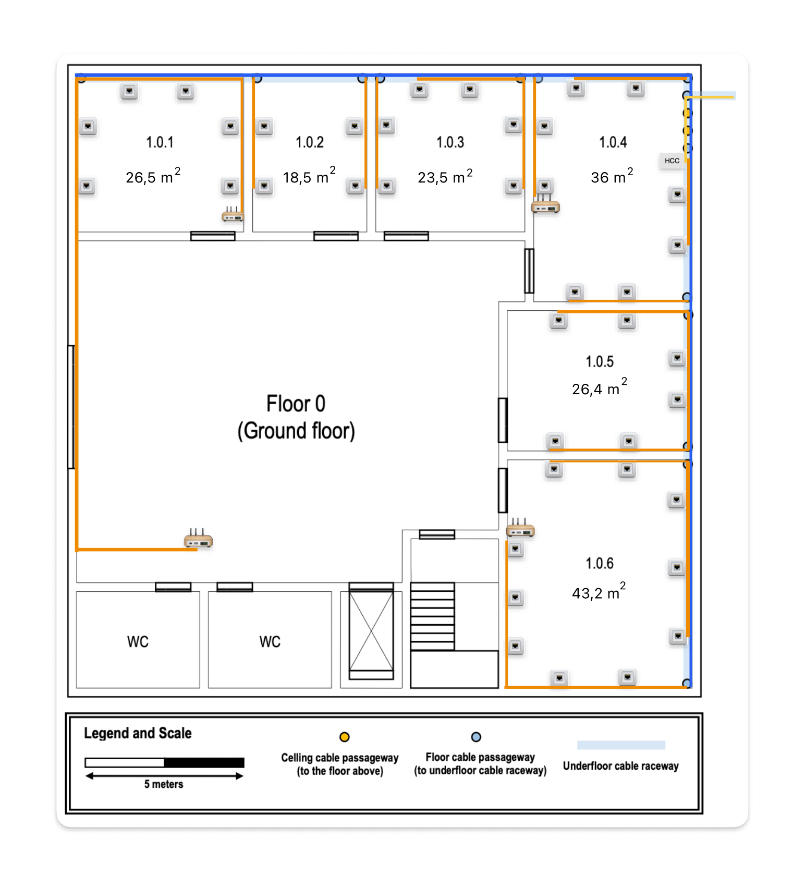
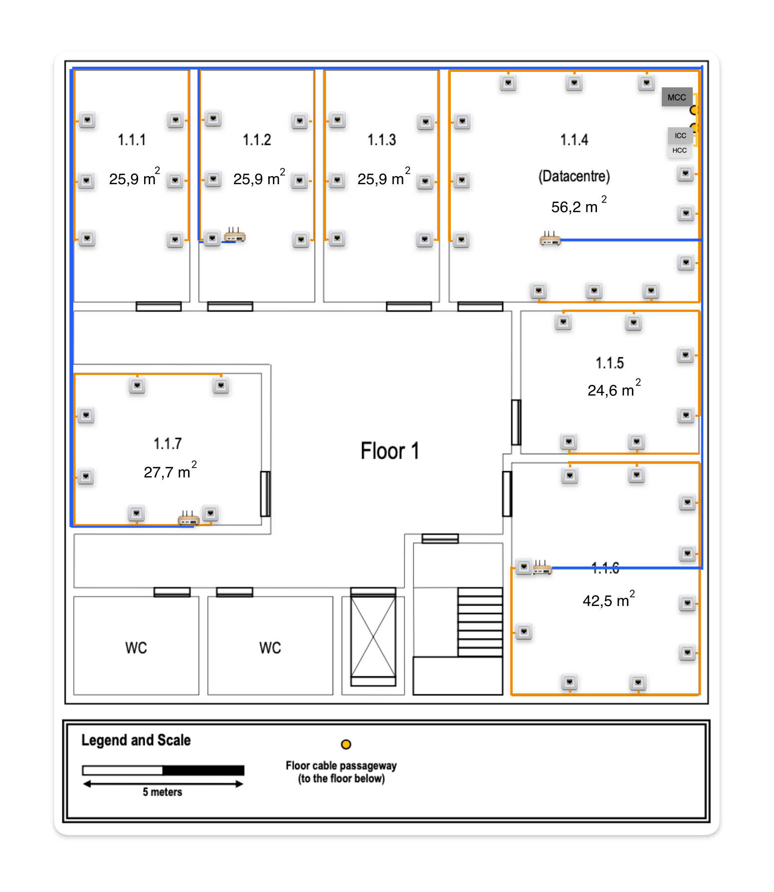

# Building 1 #
## 1. Introduction
    This file documents the planning of the Building 1.

### 1.2. Subtitles ###

## 2. Campus Backbone ##

### 2.1. Layout ###

### 2.2. Cabling ###

    The total length for cabling the campus backbone is 2039,6 meters of Monomode Optical Fiber. 
    In order to have backbone redundant connections, 2 cables were used that follow different paths
    between the MCC and the ICCs of all buildings. 
    This allows to maintain the connection, in case of interference on one of the paths.
    The following table shows the length of cable required for each connection between buildings.

| Building | Path 1 (m) | Path 2 (m) | Optical Fiber Cable (m) |
|:--------:|:----------:|:----------:|:-----------------------:|
|  1 -> 2  |    41,1    |   638,9    |           680           |
|  1 -> 3  |    290     |    390     |           680           |
|  1 -> 4  |   246,3    |   433,3    |          679,6          |

## 3. Building Structure ##
### 3.1. Building Information ###
    This building holds the datacentre (room 1.1.4), it will also house the main cross-connect for the 
    structured cabling system. Both floors have wireless LAN coverage (Wi-Fi).

    Number of floors: 2
    Area: 20x20 (400 m^2)

### 3.2. Ground Floor ###
    The ground floor has an underfloor cable raceway connected to the external technical ditch. 
    Access to the underfloor cable raceway is available at points marked over the plan at the image below. Also, cable
    passageways to the above floor are available.
    The ceiling height on this floor is 4 meters

### 3.2.1. Floor Layout ###

### 3.2.2. Rooms ###

| Rooms  |  Size   | Area | Outlets |
|:------:|:-------:|:----:|:-------:|
| 1.0.1  | 5,3 x 5 | 26,5 |    6    |
| 1.0.2  | 3,7 x 5 | 18,5 |    4    |
| 1.0.3  | 4,7 x 5 | 23,5 |    6    |
| 1.0.4  | 5 x 7,2 |  36  |    8    |
| 1.0.5  | 6 x 4,4 | 26,4 |    6    |
| 1.0.6  | 6 x 7,2 | 43,2 |   10    |

### 3.3. First Floor ###
    The ceiling height on this floor is 3 meters, however there’s a removable dropped ceiling, placed 2.5
    meters from the ground, covering the entire floor.
    This floor has no underfloor cable raceways.

### 3.3.1. Floor Layout ###

### 3.3.2. Rooms ###

| Rooms  |   Size    | Area | Outlets |
|:------:|:---------:|:----:|:-------:|
| 1.1.1  | 3,6 x 7,2 | 25,9 |    6    |
| 1.1.2  | 3,6 x 7,2 | 25,9 |    6    |
| 1.1.3  | 3,6 x 7,2 | 25,9 |    6    |
| 1.1.4  | 7,8 x 7,2 | 56,2 |   12    |
| 1.1.5  | 5,6 x 4,4 | 24,6 |    6    |
| 1.1.6  | 5,9 x 7,2 | 42,5 |   10    |
| 1.1.7  | 5,9 x 4,7 | 27,7 |    6    |

## 4. Network Outlets and  Access Points ###
    We assumed that this building will be used by a large number of people, so we designed the network to support an equally large number of devices simultaneously.
    The number of devices that the network support simultaneously can be increased by upgrading the model of the access points or adding more access points.
    In this project, we chose a model that supports up to 30 devices.
    Please note that adding more access points may change the layout and configuration of the rest.

### 4.1. Network Outlets ###
#### 4.1.1. Overview ####

| Floor  | Outlets |
|:------:|:-------:|
| Ground |   40    |
| First  |   52    |

#### 4.1.2. Configuration ####
    For each 10 squared meters there should be installed 2 network outlets.
    No outlets are necessary in common areas.

### 4.2. Access Points ###
#### 4.2.1. Overview ####

| Floor  | Access Points | Max Devices (people) |
|:------:|:-------------:|:--------------------:|
| Ground |       4       |       120 (60)       |
| First  |       4       |       120 (60)       |

#### 4.2.2. Configuration ####
    All the access points are placed in the ceiling.
    The power and the range of the signal are configured individually for each access point to garantee that the signals of every access point don't overlap more than 15% with each other and also to not waste signal to the outside of the building.
    The radius of every access point is configured to be around 6-7 meters.

#### 4.2.3 Location ####
##### 4.2.1. Ground Floor #####

##### 4.2.2. First Floor #####

## 5. Cross-Connections ##

### 5.1. Location ###

#### 5.1.1. Intermediate Cross-Connect (ICC) #### 
    Only one ICC is needed for this building.
    The intermediate cross-connect for this building is located in the room 1.1.4.
    For this to be possible, the optical fiber coming from the outside the building is being conducted to this room via underground cable passageways.

#### 5.1.2. Horizontal Cross-Connects (HCCs) ####
    Only 2 HCCs are needed in this building, 1 per floor.
    In the ground floor it's located in the room 1.0.4 and in the first floor, it's right above, in room 1.1.4.

#### 5.1.3. Main Cross-Connect (MCC) ####
    The MCC was installed on floor 1, in the datacentre.
    All fiber optic cables coming from other buildings connect to the MCC.

## 6. Cables ##
### 6.1. Layout ###
#### 6.1.1. Ground Floor ####

#### 6.1.2. First Floor ####

### 6.2. Types ###
    Optical fiber cables were used on the backbone cabling system.
    The copper cables are used to make the connection from the HCC to the outlets and access points.
    The type of the cables was determined to be Monomode Optical Fiber and Cat7 Coper Cables.

### 6.3. Length ###
#### 6.3.1. Ground Floor ####

    To wire this floor, a total of 701,9 meters of copper cable is needed to 
    connect with all 40 outlets and 4 access points.

| Room  | Copper Cable | Optical Fiber Cable |
|:-----:|:------------:|:-------------------:|
| 1.0.1 |    189,05    |          0          |
| 1.0.2 |     68,4     |          0          |
| 1.0.3 |     71,7     |          0          |
| 1.0.4 |     64,2     |          2          |
| 1.0.5 |     54,6     |          0          |
| 1.0.6 |    209,45    |          0          |
| TOTAL |    701,9     |          0          |

#### 6.3.2. Floor 1 ####

    To wire this floor, a total of 1051,2 meters of copper cable is needed to 
    connect with all 52 outlets and 4 access points.

| Room  | Copper Cable | Optical Fiber Cable |
|:-----:|:------------:|:-------------------:|
| 1.1.1 |    149,2     |          0          |
| 1.1.2 |    149,85    |          0          |
| 1.1.3 |     103      |          0          |
| 1.1.4 |     95,6     |         1,7         |
| 1.1.5 |    74,35     |          0          |
| 1.1.6 |    219,2     |          0          |
| 1.1.7 |     260      |          0          |
| TOTAL |    1051,2    |          0          |

## 7. Patch Panels ##

    Since patch panels should meet the cable specifications and we decided to use CAT7 Cables, all of the patch panels are also CAT7.
    Monomode Optical Fiber Cable were selected, so Fiber Patch Panels should be Monomode compatible as well.
    Since 40 outlets are installed on the ground floor, a patch panel with 48 ports will be required and on the first floor, with 52 outlets,
    it'll be required a patch pannel with 24 ports and another with 48 ports.

| Floor  | Outlets | 24 ports Patch Panels | Switches |        Racks         |
|:------:|:-------:|:---------------------:|:--------:|:--------------------:|
| Ground |   40    |           2           |    2     | (2U + 2U) * 2U = 8U  |
| First  |   52    |           3           |    3     | (3U + 3U) * 2U = 12U |

    We decided to use only 24 ports CAT7 copper patch panels, each one takes 1U.
    For each corresponding switch is also added 1U, and at the end, 100% oversize must be added.

## 8. Inventory ##

| Floor  | Outlets | Access Points | MCC | HCC | ICC | Copper Cable (m) | Optical Fiber Cable (m) |
|:------:|:-------:|:-------------:|:---:|:---:|:---:|:----------------:|:-----------------------:|
| Ground |   40    |       4       |  0  |  1  |  0  |      701,9       |         1051,2          |
| First  |   52    |       4       |  1  |  1  |  1  |      1051,2      |           1,7           |