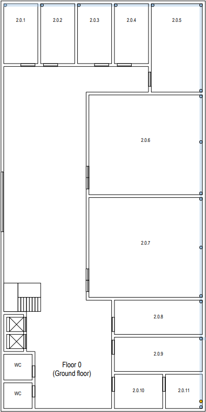
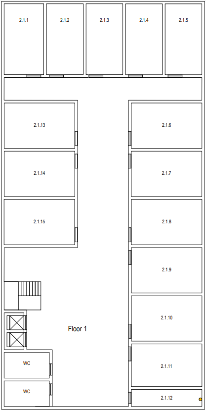

# Edificio 2 
## Indice
* Imagens dos pisos
* Area do edificio
* Defesa das estratégias usadas
* Medição de cada piso
* Inventario dos produtos usados para o desencolvimento da estrutura
* Estrutura final

## Imagem dos pisos
### Piso 0

### Piso 1

## Area do edificio
    Numero de pisos : 2
    Area de cada piso : 20*40 = 800m^2
    Area total : 2*800 = 1600m^2

## Defesa das estratégias usadas
### Piso 0
    Para o piso 0 foram usadas calhas colocadas no subsolo, dentro dessas calhas percorriam os fios de cobre do tipo CAT7.
    Essas calhas percorreram um comprimento e uma largura do piso 0 de forma que exista sinal em todas as salas.
    Cada sala com a exceção da sala 2.0.11 / 2.0.6 e 2.0.7 estão equipadas com outlet plugs de acordo com o rácio esperado (2 outlets por cada 10m^2), quanto a sala 2.0.6 e a sala 2.0.7 tinha intruções que diziam que apenas iriam ser necessarias 5 outlet plugs, no caso da sala 2.0.11 e devido a sua localizaçao foi lhe atribuido um papel de distribuiçao logo não foi preciso ter qualquer tipo de outlet.

    No piso 0 foram colocados 4 Access Points todos com menos de 30 metros de diametro, de modo a que toda area do piso fosse coberta por sinal.
    O piso contem recebe tambem uma fibra otica e contem um ICC e um HCC
### Piso 1
    Para o piso 1 as calhas foram colocadas por cima do teto falso, tambem percorreu dentro dessas calhas toda a extensão do fio de cobre.
    No piso 1 apesar das calhas estarem no teto, foi preciso descer cada fio 3 metros a contar do teto para o fio chegar ao chão que é onde estão colocados os outlets.
    Neste piso a sala 2.1.12 foi utilizada para receber os cabos que subiram do piso 0 e fazer a sua distribuição para todas as salas do piso 1. 

    No piso 1 foram tambem colocados 4 Access Points mas distribuidos de maneira diferente para não existir sobreposição de sinal em relacaçao aos AP do piso 0.
    Neste piso optei por ligar os outlets todos ao HCC mas poderia ter tambem optado por outra abordagem que se resume a colocar Consolidation Points onde existe uma maior concentração de outlets, desse modo poupavamos no fio de cobre pois bastava ligar um CP ao HCC.
    
    Sabemos tambem que o piso 1 nao recebe diretamente fibra otica nem possui um ICC.
## Medição de cada piso
### Piso 0

|    Sala    | Area por Sala | Largura  | Comprimento |
|:----------:|:-------------:|:--------:|:-----------:|
| 2.0.1  		  |    	19,14     |		3,3 | 5,8 |        
|  2.0.2 		  |    	19,14     |		3,3	 | 	5,8	  |         
|  2.0.3 		  |    	19,14     |		3,3	 |  	 5,8   |         
| 2.0.4  		  |    	19,14     |		3,3	 |	5,8	 |         
| 2.0.5  		  |   	43,00		    |5	 |	8,6	 |        
| 2.0.6  		  |   	106,7		    |	11	 | 9,7 |                      
| 2.0.7  		  |   	106,7		    |	11	 | 9,7 |         
| 2.0.8  		  |   	28,38		    |	8,6	 |	3,3	 |        
| 2.0.9  		  |   	28,38		    |	8,6	 |	3,3	 |         
| 2.0.10  		 |   		15,84		   |		4,8	 |3,3 |
| 2.0.11  		 |   		12,54		   |		3,8 |3,3 |

### outlets por sala piso 0

|    Sala    |  Outlets por Sala  | 
|:----------:|:------------------:|
| 2.0.1  		  |         4          | 		      
|  2.0.2 		  |         	4         | 		  
|  2.0.3 		  |         	4         | 		    
| 2.0.4  		  |         	4         | 		    
| 2.0.5  		  |        	5		        |      
| 2.0.6  		  |        	5		        | 	                  
| 2.0.7  		  |        	5		        | 	      
| 2.0.8  		  |        	6		        | 	     
| 2.0.9  		  |        	6		        | 	       
| 2.0.10  		 |       		3		        | 		
| 2.0.11  		 |       		0		        | 		

### Piso 1

|    Sala    | Area por Sala | Largura | Comprimento |
|:----------:|:-------------:|:-------:|:-----------:|
| 2.1.1  		  |     	28,4     |   		4   |     7,1     |        
|  2.1.2 		  |     	28,4     |  		4	   |    	7,1     |         
|  2.1.3 		  |     	28,4     |  		4	   |    	 7,1    |         
| 2.1.4  		  |     	28,4     |  		4	   |    	7,1	    |         
| 2.1.5  		  |    	28,4		    |   4	    |    	7,1	    |        
| 2.1.6  		  |   	32,66		    |  	7,1	  |     4,6     |                      
| 2.1.7  		  |   	32,66		    |  	7,1	  |     4,6     |         
| 2.1.8  		  |   	32,66		    |  	7,1	  |    	4,6     |        
| 2.1.9  		  |   	32,66		    |  	7,1	  |    	4,6	    |         
| 2.1.10  		 |   		32,66		   |  		7,1  |     4,6     |
| 2.1.11  		 |   		32,66		   |  		7,1  |     4,6     |
| 2.1.12  		 | 	    12,78		  |  	7,1	  |    	1,8	    |        
| 2.1.13 		  |   	32,66		    |  	7,1   |    	4,6	    |         
| 2.1.14  		 |   		32,66		   | 		7,1	  |     4,6     |
| 2.1.15  		 |   		32,66		   |  		7,1  |     4,6     |

### outlets por sala piso 1
|    Sala    | Outlets por Sala | 
|:----------:|:----------------:|
| 2.1.1  		  |        	6        | 		      
|  2.1.2 		  |        	6        | 		  
|  2.1.3 		  |        	6        | 		    
| 2.1.4  		  |        	6        | 		    
| 2.1.5  		  |       	6		       |      
| 2.1.6  		  |       	8		       | 	                  
| 2.1.7  		  |       	8		       | 	      
| 2.1.8  		  |       	8		       | 	     
| 2.1.9  		  |       	8		       | 	       
| 2.1.10  		 |      		8		       | 		
| 2.1.11  		 |      		8		       | 		
| 2.1.12  		 |       	0		       | 	     
| 2.1.13 		  |       	8		       | 	       
| 2.1.14  		 |      		8		       | 		
| 2.1.15  		 |      		8		       | 

## Inventario
### Piso 0

|      Produto       | Quantidade Metro ou unidade | 
|:------------------:|:---------------------------:|
|   Calha solo  		   |            	1412            | 		      
|   Calha teto 		    |             	35             | 		  
|     Outlet 		      |             	47             | 		    
| Fio Cobre CAT7  		 |            	1447            | 		    
|  Fibra Otica  		   |            	1		             |

### Piso 1

|      Produto       | Quantidade Metro ou unidade |
|:------------------:|:---------------------------:|
|   Calha solo  		   |             	80             |
|   Calha teto 		    |            	3949            |
|     Outlet 		      |            	102             |
| Fio Cobre CAT7  		 |            	4029            |
|  Fibra Otica  		   |            	0		             |

 ## Estrutura final 
### Piso 0 com AP, HCC e ICC

### Piso 0 com AP Range, HCC e ICC

### Piso 1 com AP e HCC

### Piso 0 com AP Range e HCC
