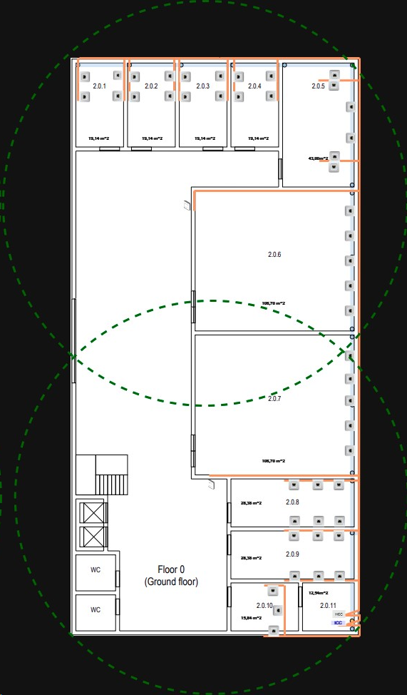

# Edificio 2 
## Indice
* Imagens dos pisos
* Defesa das estratégias usadas
* Medição de cada piso
* Inventario dos produtos usados para o desencolvimento da estrutura

## Imagem dos pisos
### Piso 0   

### Piso 1
Colocar imagem 
## Defesa das estratégias usadas
### Piso 0
Para o piso 0 foram usadas calhas colocadas no subsolo, dentro dessas calhas percorriam os fios de cobre do tipo CAT7.
Essas calhas percorreram um comprimento e uma largura do piso 0 de forma que exista sinal em todas as salas.
Cada sala com a exceção da sala 2.0.11 / 2.0.6 e 2.0.7 estão equipadas com outlet plugs de acordo com o rácio esperado (2 outlets por cada 10m^2), quanto a sala 2.0.6 e a sala 2.0.7 tinha intruções que diziam que apenas iriam ser necessarias 5 outlet plugs, no caso da sala 2.0.11 e devido a sua localizaçao foi lhe atribuido um papel de distribuiçao logo não foi preciso ter qualquer tipo de outlet.
### Piso 1

## Medição de cada piso
### Piso 0

| Sala       | Area por Sala | Largura  | Comprimento |
|:-----------|:--------------|:---------|:------------|
| 2.0.1  		  | 	19,14        | 		3,3| 5,8 |        
| 2.0.2 		   | 	19,14        | 		3,3	| 	5,8	  |         
| 2.0.3 		   | 	19,14        | 		3,3	| 	 5,8    |         
| 2.0.4  		  | 	19,14        | 		3,3	| 	5,8	|         
| 2.0.5  		  | 	43,00		      | 5	| 	8,6	|        
| 2.0.6  		  | 	106,7		      | 	11	| 9,7 |                      
| 2.0.7  		  | 	106,7		      | 	11	| 9,7 |         
| 2.0.8  		  | 	28,38		      | 	8,6	| 	3,3	|        
| 2.0.9  		  | 	28,38		      | 	8,6	| 	3,3	|         
| 2.0.10  		 | 		15,84		     | 		4,8	| 3,3|
| 2.0.11  		 | 		12,54		     | 		3,8| 3,3|

| Sala       | Outlets por Sala | 
|:-----------|:-----------------|
| 2.0.1  		  | 	4               | 		      
| 2.0.2 		   | 	4               | 		  
| 2.0.3 		   | 	4               | 		    
| 2.0.4  		  | 	4               | 		    
| 2.0.5  		  | 	5		             |      
| 2.0.6  		  | 	5		             | 	                  
| 2.0.7  		  | 	5		             | 	      
| 2.0.8  		  | 	6		             | 	     
| 2.0.9  		  | 	6		             | 	       
| 2.0.10  		 | 		3		            | 		
| 2.0.11  		 | 		0		            | 		

### Piso 1

| Sala       | Area por Sala | Largura | Comprimento |
|:-----------|:--------------|:--------|:------------|
| 2.1.1  		  | 	28,4         | 		4     | 7,1         |        
| 2.1.2 		   | 	28,4         | 		4	    | 	7,1        |         
| 2.1.3 		   | 	28,4         | 		4	    | 	 7,1       |         
| 2.1.4  		  | 	28,4         | 		4	    | 	7,1	       |         
| 2.1.5  		  | 	28,4		       | 4	      | 	7,1	       |        
| 2.1.6  		  | 	32,66		      | 	7,1	   | 4,6         |                      
| 2.1.7  		  | 	32,66		      | 	7,1	   | 4,6         |         
| 2.1.8  		  | 	32,66		      | 	7,1	   | 	4,6        |        
| 2.1.9  		  | 	32,66		      | 	7,1	   | 	4,6	       |         
| 2.1.10  		 | 		32,66		     | 		7,1   | 4,6         |
| 2.1.11  		 | 		32,66		     | 		7,1   | 4,6         |
| 2.1.12  		 | 	    12,78		  | 	7,1	   | 	1,8	       |        
| 2.1.13 		  | 	32,66		      | 	7,1    | 	4,6	       |         
| 2.1.14  		 | 		32,66		     | 		7,1	  | 4,6         |
| 2.1.15  		 | 		32,66		     | 		7,1   | 4,6         |

| Sala       | Outlets por Sala | 
|:-----------|:-----------------|
| 2.1.1  		  | 	6               | 		      
| 2.1.2 		   | 	6               | 		  
| 2.1.3 		   | 	6               | 		    
| 2.1.4  		  | 	6               | 		    
| 2.1.5  		  | 	6		             |      
| 2.1.6  		  | 	8		             | 	                  
| 2.1.7  		  | 	8		             | 	      
| 2.1.8  		  | 	8		             | 	     
| 2.1.9  		  | 	8		             | 	       
| 2.1.10  		 | 		8		            | 		
| 2.1.11  		 | 		8		            | 		
| 2.1.12  		 | 	0		             | 	     
| 2.1.13 		  | 	8		             | 	       
| 2.1.14  		 | 		8		            | 		
| 2.1.15  		 | 		8		            | 

## Medir comprimento de calhas / comprimento de fio de rede CAT7 / numero de outlets / numero de Consolidation points / numero de access Points / Onde colocar o HCC e ICC ###
### Piso 0
    | Sala | Area por Sala | Largura | Comprimento |
    |------|---------------|---------|-------------|
    |2.0.1:|
    |2.0.2:| 
    |2.0.3:|
    |2.0.4:|
    |2.0.5:| 
    
### Inventario ###
Pesquisar pelo preço de cada componente por unidade e por metro

