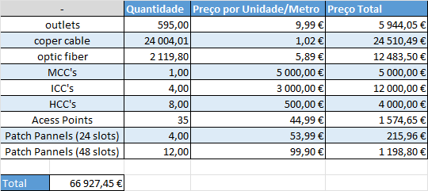

# Project 1 - Sprint 1 planning #

### 1. Scrum Master: ###
**Eduardo Carreiro (1211199).**

### 2. Backlog: ###

| Task  |                                       Task description                                        |          Assignee          |
|:-----:|:---------------------------------------------------------------------------------------------:|:--------------------------:|
| T.1.1 | Development of a structured cabling project for building 1, encompassing the campus backbone. |  Beatriz Morais (1221401)  |
| T.1.2 |                  Development of a structured cabling project for building 2.                  |   Rui Moreira (1221696)    |
| T.1.3 |                  Development of a structured cabling project for building 3.                  | Eduardo Carreiro (1211199) |
| T.1.4 |                  Development of a structured cabling project for building 4.                  |  Diogo Correia (1212106)   |

### 3. Subtasks ###
#### 3.1 Global Subtasks ####

- Estimate each room's area and a resulting standard number of network outlets per building;
- Pinpoint outlets position over the provided floor plans;
- Decide cross-connects locations over the provided floor plans;
- Define cable pathways and cable types over the provided floor plans;
- Select cable types;
- Structured cabling hardware inventory.

### 4. Global Technical Decisions ###

#### 4.1 Copper Cabling Wiring: ####
- Cat7;
- 568A Wiring Standard.

#### 4.2 Optical Fiber Cabling Wiring ####
- Monomode optical fibre.

#### 4.3 Access Points ####
- Maximum of 30 accesses per access point (15 estimated people per access point);
- Each person is restricted to 2 accesses at a time (example: smartphone and laptop).

#### 4.4 Cross-Connects ####
- MCC: 1 per campus;
- ICC: 1 per building;
- HCC: 1 per floor.
- MCC: is located in the datacenter of building 1;

#### 4.5. Budget ####
- The prices used for this budget are based on a average of the Amazon market list for these products.

