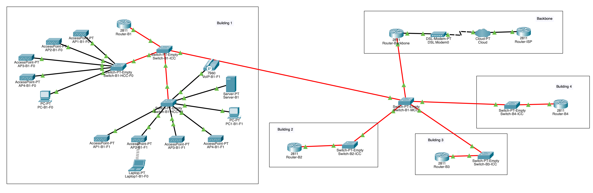

# Project 1 - Sprint 2 - Building 1 #

### 1. IPv4 addresses ###
#### 1.1. Backbone ####
    Backbone: 200 nodes

#### 1.2. Building 1 ####
    End user outlets on the ground floor: 50 nodes
    End user outlets on floor one: 50 nodes
    Wi-Fi network: 80 nodes
    DMZ (Servers, administration workstations, and network infrastructure devices): 100 nodes
    VoIP (IP-phones): 67 nodes

### 2. VLANs ###

 | Vlan Id |   Name    | Nodes |         IP          |      Mask       |
 |:-------:|:---------:|:-----:|:-------------------:|:---------------:|
 |   384   | Backbone  |  200  |  172.23.192.0 / 24  |  255.255.255.0  |
 |   385   |  B1-DMZ   |  100  |  172.23.193.0 / 25  | 255.255.255.128 |
 |   386   |  B1-WIFI  |  80   | 172.23.193.128 / 25 | 255.255.255.128 | 
 |   387   |  B1-VOIP  |  67   |  172.23.194.0 / 25  | 255.255.255.128 |
 |   388   | B1-OUT-F0 |  50   | 172.23.194.128 / 26 | 255.255.255.192 |
 |   389   | B1-OUT-F1 |  50   | 172.23.194.192 / 26 | 255.255.255.192 |

### 3. Building 1 simulation ###

